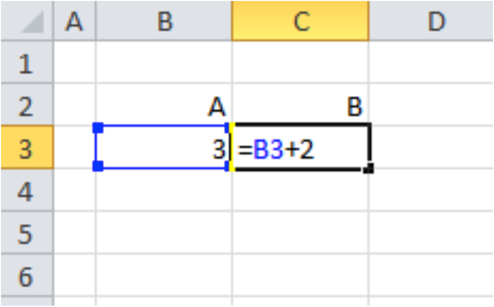
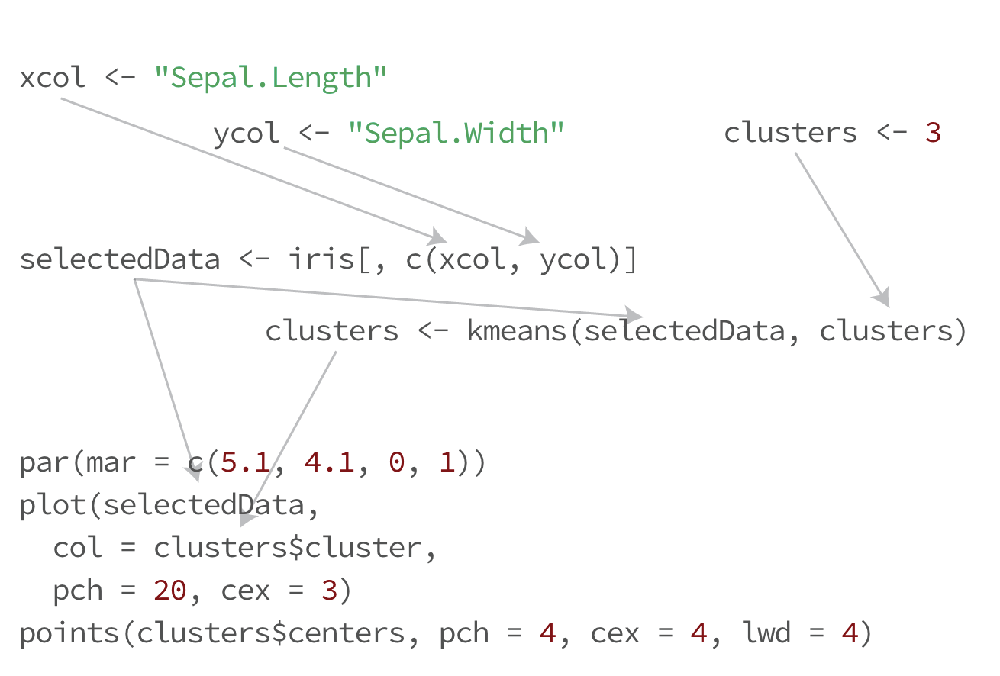
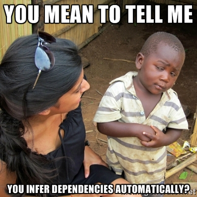

## Motivation

```{r echo=FALSE}
library(ggvis, warn.conflicts = FALSE)
library(knitr)
options(shiny.suppressMissingContextError=TRUE)
temporal <- function(expr, ms=1000, domain=getDefaultReactiveDomain()) {
  invalidateLater(ms, domain)
  expr
}
```

Let R users build their own **interactive** artifacts

```{r echo=FALSE}
distributions <- c(
  Uniform = 'runif',
  Normal = 'rnorm',
  Exponential = 'rexp',
  Cauchy = 'rcauchy',
  'Log Normal' = 'rlnorm'
)
dist <- reactive({
  if (!input$dist %in% distributions)
    stop("Invalid distribution")
  get(input$dist, pos = 'package:stats')
})
randoms <- reactive(dist()(input$n))
sidebarLayout(
  sidebarPanel(
    selectInput('dist', 'Distribution', distributions, selectize = FALSE),
    numericInput('n', 'n', 5000)
  ),
  mainPanel(
    renderPlot({
      value <- randoms()
      hist(value, breaks = 30, main = input$dist,
        col = "#AAAAAA", border = 'white')
    })
  )
)
```

## But UI programming is hard!

```{r eval=FALSE}
library(gWidgets)
txt <- gtext("Customize me", container = gwindow(),
  #<b>
  handler = function(h, ...) {
    # Do something in response to text changing
  }
  #</b>
)
btn <- gbutton("Click me", container = gwindow(),
  #<b>
  handler = function(h, ...) {
    # Do something in response to a button click
  }
  #</b>
)
```

- Every callback introduces side effects
- Callbacks are hard to reason about, hard to compose
- Bugs are subtle, conditional on sequences of events
- In short: "callback hell"

## Reactive programming

A way of building programs for <u>values that change over time</u>...

For example:

- The value of a specific variable
- The current date/time: `r renderText(temporal(format(Sys.time())))`
- The contents of a specific file on disk
- But most commonly, user inputs:
```{r}
numericInput('x', 'Please enter a number', 5)
```

(The value of `rows` is now `r renderText(input$x)`.)

## Reactive programming

A way of building programs for values that change over time and expressions that stay updated over time.



## Reactive programming

- Reactive programming is decades old
    - Conal Elliott and Paul Hudak. [Functional Reactive Animation.](http://conal.net/papers/icfp97/) In the proceedings of the 1997 ACM SIGPLAN International Conference on Functional Programming (ICFP ’97).
- Languages centered around reactive programming ([Elm](http://elm-lang.org/), [Flapjax](http://www.flapjax-lang.org/))
- Frameworks and libraries for reactive programming exist for .NET, Scala, Lisp, Go, C++...
- Particularly prevalent in JavaScript UI frameworks (Meteor, Ember, Angular, React.js...)
- Lots of different approaches to reactive programming; ours is most directly inspired by [Meteor](http://stackoverflow.com/questions/10260015/how-does-meteors-reactivity-work-behind-the-scenes)

## The problem reactive programming solves in Shiny

>- Many apps can be described as continuously
    - taking **input** from the user,
    - performing various **calculations** based on that input, and
    - displaying some **outputs** based on those calculations.
- When an input changes, any calculations and outputs that are affected need to be updated/re-executed.
- How do we identify the exact set of calculations and outputs that are affected? (Too many = inefficient, too few = incorrect results.)

## Iris example

```{r eval=FALSE}
# Inputs
xcol <- "Sepal.Length"
ycol <- "Sepal.Width"
clusters <- 3

# Calculated values
selectedData <- iris[, c(xcol, ycol)]
clusters <- kmeans(selectedData, clusters)

# Output
par(mar = c(5.1, 4.1, 0, 1))
plot(selectedData,
  col = clusters$cluster,
  pch = 20, cex = 3)
points(clusters$centers, pch = 4, cex = 4, lwd = 4)
```

## Iris example



## Reactive iris example

```{r eval=FALSE}
# `input` is a special environment that reflects current user input

# Reactive expression that depends on input$xcol, input$ycol
#<b>
selectedData <- reactive({
#</b>
  iris[, c(input$xcol, input$ycol)]
})

# Reactive expression that depends on selectedData, input$clusters
#<b>
clusters <- reactive({
#</b>
  kmeans(selectedData(), input$clusters)
})

# Reactive output that depends on selectedData, clusters
#<b>
renderPlot({
#</b>
  par(mar = c(5.1, 4.1, 0, 1))
  plot(selectedData(),
       col = clusters()$cluster,
       pch = 20, cex = 3)
  points(clusters()$centers, pch = 4, cex = 4, lwd = 4)
})
```

## Reactive iris example

https://jcheng.shinyapps.io/kmeans/

## How does it work?

<p align="center">

</p>

## How does it work?

- The Shiny reactive programming model has three classes of reactive objects:
<p align="center">


</p>
- Reactive sources, conductors, and endpoints arrange themselves into graphs during code evaluation
<p align="center">

</p>
- New/updated values enter the graph from the left and traverse all the conductors/endpoints that are reachable

## How does it work?

- This works using two simple tricks:
    - Maintain a global variable pointing to the currently executing "context" (conductor or endpoint)
    - Reading from a reactive source or conductor returns the desired value, but also has a side effect: the current context is connected to the source/conductor

## That's all there is to it

**If an R object/function isn't one of these three things, it can't directly affect reactive execution.**

```{r}
x <- 10
y <- reactive(x)
print(y())
x <- 20
print(y())
```

`y()` is still 10, because `x` is not a reactive source.

## Rules of the road

Reactive expressions (`reactive(…)`) are lazily evaluated and cache their outputs. So avoid side effects!

Observers (endpoints) are eagerly executed and don't return values---useful only for side effects.

Nested reactive expressions is almost always a sign that you're doing it wrong. Stop and try again.

## Building on reactive values, expressions, observers

- Reactive abstractions
    - `isolate(…)` - ignores any reactivity in the given expression
    - `observe(…)` + `isolate(…)` - traditional event handling on top of reactives
    - `invalidateLater(millis)` - time-based reactives
    - `reactivePoll()` - react to changes in a database
    - Fold over time, select/filter over time, rate limiting
    - Observers that create new observers
    - Reactive graph inspector (`?showReactLog`)

## Success stories

- Thousands of Shiny applications have been deployed by R users to RStudio servers alone
- Anecdotally, even fairly new R users have successfully gotten started with Shiny
- Even without a clear understanding of reactivity, it's possible to build robust (though perhaps inefficient) interactive applications
- Advanced users have deployed apps with hundreds or even thousands of reactives

## Reactivity is the foundation for dynamicity in [ggvis](http://ggvis.rstudio.com)

```{r}
#<b>
reactiveFileReader(500, session, "mtcars.csv", read.csv) %>%
#</b>
  ggvis(~wt, ~mpg) %>%
  layer_points() %>%
  layer_smooths(span = 0.3, stroke := "red")
```

## For more details

http://shiny.rstudio.com/articles/

See section titled "Reactive programming"
